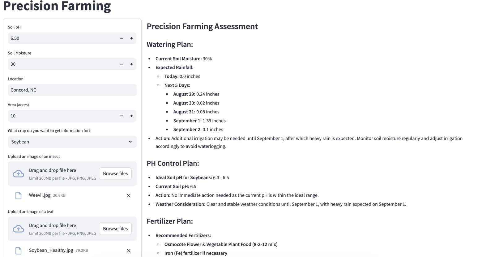
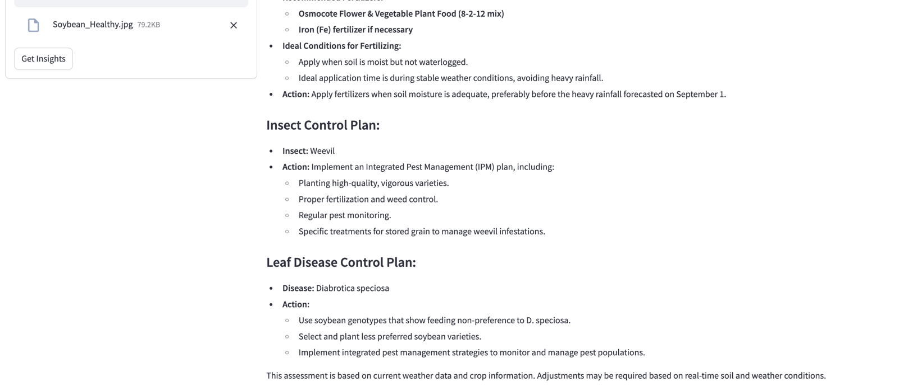

Steps to use the precision agriculture app

Set totality and open AI and upstage API keys

I have downloaded the trained models from kaggle notebook
https://www.kaggle.com/code/dheerajrhegde/tensorflow-insect-class-mobilenet
https://www.kaggle.com/code/dheerajrhegde/tensorflow-corn-leaf
https://www.kaggle.com/code/dheerajrhegde/tensorflow-cotton-leaf
https://www.kaggle.com/code/dheerajrhegde/tensorflow-soybean-leaf

Run CropVectorStore.py - creates the information vector store from NCSU website for 3 crops - corn, cotton, soybean
	- need to run only once to build the vector store

Run StreamLitApp.py as a streamline app
	uses PrecisionFarming.py which gives back a markdown text responses
	displayed in StreamLit

